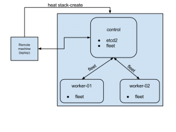

Title: Getting Started with coreos in OpenStack
Date: 2015-08-13 14:39
Category: openstack
Slug: getting-started-with-coreos-in-openstack

<div class="alert alert-primary" role="alert" style="color: #004085; background-color: #eff7ff; border-color: #b8daff; position: relative; padding: 0.75rem 1.25rem; margin-bottom: 1.5rem;">
Reblogged from my blog written for <a href="https://aptira.com/" style="color: #004085; text-decoration: underline;">@aptira</a> at <a href="https://aptira.com/getting-started-with-coreos-on-openstack/" style="color: #004085; text-decoration: underline;">getting started with coreos on openstack</a>.
</div>

CoreOS is an open-source lightweight operating system based on the Linux kernel and is designed to provide infrastructure for clustered deployments.

Microservices architecture have their advantages. In case you are building/managing your stack as containerized microservices, CoreOS is the perfect operating system. CoreOS provides only the minimal functionality required for deploying applications inside software containers, together with built-in mechanisms for service discovery and configuration sharing.

Getting started with coreos on openstack (using HEAT)This blog post shares my experiences while learning the basics of CoreOS on an OpenStack infrastructure. On completion of the article, we will have a three node cluster comprised of one control node and two worker nodes. Provisioning of the cluster will be done using OpenStack Heat templates.

On right is a simple graphics of our end cluster setup.

The code snippets used in the post are available in my public github account https://github.com/rajalokan/coreos-openstack-beginner for reference.


## PREREQUISITES:
To follow this tutorial, we need to install some binaries on the local machine.

### ETCDCTL
etcdctl is a command line client for etcd. CoreOS’s etcd is a distributed, consistent key-value store for shared configuration and service discovery.

Our control node will have the etcd service running, so on the local machine we need the etcd client installed in order to talk to the CoreOS cluster. We can install this in one step.

```
$ curl -L  https://github.com/coreos/etcd/releases/download/v2.1.1/etcd-v2.1.1-linux-amd64.tar.gz -o /tmp/etcd-v2.1.1-linux-amd64.tar.gz
$ tar xzvf /tmp/etcd-v2.1.1-linux-amd64.tar.gz -C /tmp/
$ mv /tmp/etcd-v2.1.1-linux-adm64/etcdctl /usr/local/bin && chmod +x /usr/local/bin/etcdctl
```

Make sure to add /usr/local/bin to the system PATH or call it directly using `/usr/local/bin/etcdctl`.


### fleetctl
fleet ties together systemd and etcd into a simple distributed init system. Think of it as an extension of systemd that operates at the cluster level instead of at the machine level.

fleet provides a command-line tool called `fleetctl`. We will use this to communicate with our cluster. To install, run the following commands.

```
$ curl -L https://github.com/coreos/fleet/releases/download/v0.11.2/fleet-v0.11.2-linux-amd64.tar.gz -o fleet-v0.11.2-linux-amd64
$ tar xzvf /tmp/fleet-v0.11.2-linux-amd64 -C /tmp/
$ mv /tmp/fleet-v0.11.2-linux-amd64/fleetctl /usr/local/bin && chmod +x /usr/local/bin/fleetctl
```

### python-heatclient & python-glanceclient
We will use the OpenStack heat client to spin up a VM and the OpenStack glance client to create a CoreOS image in our OpenStack infrastructure. We can install both of these client tools using pip:

```
$ pip install python-heatclient python-glanceclient
```

Next, we want to add the stable CoreOS image to glance
```
$ wget http://stable.release.core-os.net/amd64-usr/current/coreos_production_openstack_image.img.bz2
$ bunzip2 coreos_production_openstack_image.img.bz2
$ glance image-create –name CoreOS –container-format bare  –disk-format qcow2  –file coreos_production_openstack_image.img
$ glance image-list
```

Finally, we should verify that all the binaries are installed correctly. Each of the following commands `fleetctl –version` , `etcdctl –version`, `heat –version` & `glance –version` should return output with the version of the binary installed.

## START A SINGLE NODE CLUSTER
Lets keep things simple and start by spinning up a single node cluster (only the control node). This will start a single CoreOS node with fleet and etcd running on it.

### Start the cluster
Starting a cluster through HEAT requires three parameters.

#### Discovery token:

For a group of CoreOS machines to form a cluster, their etcd instances need to be connected. We are creating a discovery token for single node to help connect etcd instances together by storing a list of peer addresses, metadata and the initial size of the cluster under a unique address, known as the discovery URL.

In our example, we are using CoreOS’s discovery service to generate token ( curl -q https://discovery.etcd.io/new?size=1). We can as well use our own mechanism to generate token.

#### public network uuid

Pass your unique identification of your public network of your OpenStack infrastructure. This is needed to create router inside public network.

#### key_name

Also provide your nova keypair’s key_name for ssh access.

The exact command to start a coreos cluster is shown below:

```
$ heat stack-create -f heat-template-control.yaml -P discovery_token_url=`curl -q https://discovery.etcd.io/new?size=1` -P public_network_uuid=87cb4819-33d4-4f2d-86d2-6970c11962da trycoreos

+————————————————————+—————–+——————————+————————————-+
| id                                                                       | stack_name | stack_status                 |  creation_time                      |
+————————————————————+—————–+——————————+————————————-+
| 897f08ad-4beb-4000-a871-aaa0231ade90     | trycoreos      | CREATE_IN_PROGRES   | 2015-07-30T22:11:35Z        |
+————————————————————+—————–+——————————+————————————-+
```

The initial ‘CREATE_IN_PROGRESS’ stack_status shows that VM provisioning has started. The stack status can be checked with heat stack-show trycoreos. A ‘CREATE_COMPLETE’ stack_status means that our cluster is up. To get the floating ip address of the control node use the command heat output-show trycoreos control_ip.

### Check the cluster status
Now that we have our node ready, we can ssh to it directly by `ssh core@<ip_address>`. But let’s try using fleetctl instead to see the status of our cluster and to ssh into the VMs.

```
$  FLEETCTL_TUNNEL=”108.182.62.205″ fleetctl list-machines

+—————————–+—————————-+————————+
|  MACHINE                    |        IP                        |       METADATA       |
+—————————–+—————————-+————————+
|  0315e138…                |  192.168.222.2           |       role=control   |
+—————————–+—————————-+————————+
```

This lists the nodes in our cluster. Currently we have a single node cluster and that node has the control role. fleetctl talks to the host running the fleet service through ssh and gets information about the cluster, so the host running the fleet service must be accessible remotely via ssh.

The FLEETCTL_TUNNEL parameter specifies that the fleet service is running on a remote server with ip 108.182.62.205 (our control node). Use the floating ip address from the last section for this parameter. More information about configuring fleetctl can be found using the fleetctl client.

fleetctl can be used to monitor and to start/stop different services on our cluster. Node the ID above and use that to tell fleet to ssh to the control node:

```
$ fleetctl ssh 0315e138
```

Lets set some keys and get their values. ETCDCTL_PEERS is a comma separated list of all etcd peers. Currently we have single etcd server running on standard 2379, so we specify https://108.182.62.205:2379 below.

```
$ ETCDCTL_PEERS=”https://108.182.62.205:2379″ etcdctl ls
$ etcdctl ls –recursive
$ etcdctl set topic coreos
$ etcdctl get topic
coreos
```

We can use –debug option to understand what API is being called. This gives an overview on etcd’s RESTful api.

```
$ etcdctl –debug get topic
Cluster-Endpoints: http://108.182.62.205:2379
Curl-Example: curl -X GET http://108.182.62.205:2379/v2/keys/topic?quorum=false&recursive=false&sorted=false
```

#### coreos
More information about API can be found at coreos-api.

#### Insight
Let’s understand cluster setup and see how CoreOS cluster talks to each other.

heat template
The heat template is pretty self-explanatory. It consists of all the required services and uses cloud config to initialise data during the CoreOS bootstrap.

cloud-init
As part of heat-template-control.yaml, we are provisioning a single node with cloud config:

### cloud-config
```
coreos:
fleet:
etcd_servers: http://127.0.0.1:2379
metadata: role=control
etcd2:
name: etcd2
discovery: $token_url
advertise-client-urls: http://$public_ipv4:2379
initial-advertise-peer-urls: http://$public_ipv4:2380
listen-client-urls: http://0.0.0.0:2379
listen-peer-urls: http://0.0.0.0:2380
units:
– name: etcd2.service
command: start
– name: fleet.service
command: start
update:
group: alpha
reboot-strategy: reboot
```

This follows the standard CoreOS cloud-init guide to initialize a system. Fleet and etcd2 services are already present within CoreOS alpha channel. We try to override the default etcd2 and fleet configuration with custom parameters.

First two lines are for configuring fleet & etcd2. This fleet running on node about etcd servers (a comma separated servers) and their role. These config are placed in etcd2 service at  /run/systemd/system/fleet.service.d/20-cloud-init and they override during etcd startup. Similarly etcd config are placed at /run/systemd/system/etcd2.service.d/20-cloud-init inside control node for overriding.

In the unit section, we are passing the command to start both these services.

CoreOs has an update strategy that consists of three channels; alpha, beta and stable. The alpha channel is the most recent release and it closely tracks current development work. It is released very frequently. The beta channel consists of promoted alpha releases that have received more testing and is released less often that alpha. The stable channel should be used for a stable production CoreOS cluster.

To see what channel is being used, look into /etc/coreos/update.conf.

### Conclusion

This concludes the basic single node setup of a CoreOS cluster. This doesn’t do much but gives us a brief understanding of the underlying concepts of CoreOS. We can verify the status of both the services after sshing into a node and using the following commands: alok@remote $ systemctl status etcd2 &alok@remote $ systemctl status fleet

## START A MULTI NODE CLUSTER

Now that we are confident with CoreOS cloud init, systemd and HEAT templates, lets run a cluster with one control and two worker nodes.

Delete the old openstack cloud

### Delete old stack created with single node
```
$ heat stack-delete trycoreos
```

Run stack-create for new cluster setup.
### Create another stack for three nodes

```
$ heat stack-create -f heat-template.yaml -P discovery_token_url=`curl -q https://discovery.etcd.io/new?size=3` -P public_network_uuid=87cb4819-33d4-4f2d-86d2-6970c11962da trycoreos
+——————————————————–+———————+——————————+——————————-+
| id                                                                  | stack_name       | stack_status                | creation_time                |
+——————————————————–+———————+——————————+——————————-+
| 897f08ad-4beb-4000-a871-aaa0231ade90 | trycoreos          | CREATE_IN_PROGRESS | 2015-07-30T22:11:35Z |
+——————————————————–+———————+——————————+——————————-+
```

This provisions three node cluster and assuming that control node has ip address 108.182.62.205, lets list machines in cluster

```
$ FLEETCTL_TUNNEL=”108.182.62.205″ fleetctl list-machines
The authenticity of host ‘108.182.62.205’ can’t be established.
RSA key fingerprint is 48:17:d4:4f:fe:33:0d:b5:44:b3:5b:11:fa:b0:e6:03.
Are you sure you want to continue connecting (yes/no)? yes
Warning: Permanently added ‘108.182.62.205’ (RSA) to the list of known hosts.
MACHINE         IP              METADATA
93c797b0…     192.168.222.2   role=node
e7d9f87f…     192.168.222.4   role=control
ee9c8044…     192.168.222.5   role=node
```

Let’s ssh to one of the nodes

```
$ fleetctl ssh ee9c8044
The authenticity of host ‘192.168.222.5’ can’t be established.
RSA key fingerprint is 95:59:c9:ed:ee:ae:4c:5d:b1:db:95:5a:5e:7a:f2:20.
Are you sure you want to continue connecting (yes/no)? yes
Warning: Permanently added ‘192.168.222.5’ (RSA) to the list of known hosts.
CoreOS alpha (752.1.0)
Failed Units: 0
$
```

### Sharing/accessing keys across cluster

Lets use etcd to list keys, set key and see them from different machines.

```
$ etcdctl ls –recursive
```

We see there is no keys set as of now.

```
$ etcdctl set coreos/network/config “192.168.3.0/24”
$ etcdctl ls –recursive
/coreos
/coreos/network
/coreos/network/config
```

Let’s verify that these are same inside the control node. To do so we SSH into the worker control node and do a recursive list of keys.

```
$ fleetctl ssh e7d9f87f
$ etcdctl ls –recursive
/coreos
/coreos/network
/coreos/network/config
$ etcdclt get /coreos/network/config
192.168.3.0/24
```

### Conclusion
This brings to an end our very basic CoreOS cluster setup and how to talk to each node in the cluster. We can now use this CoreOS cluster to host applications inside docker containers and to manage them.

> **Credit**: This is inspired by coreos-heat templates from [heat-coreos](https://github.com/sinner-/heat-coreos)
