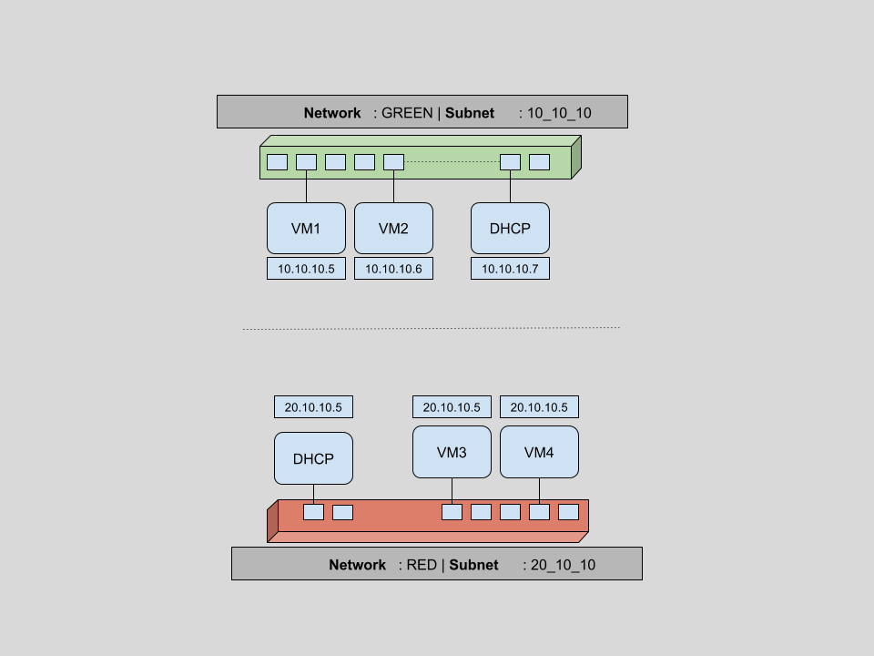
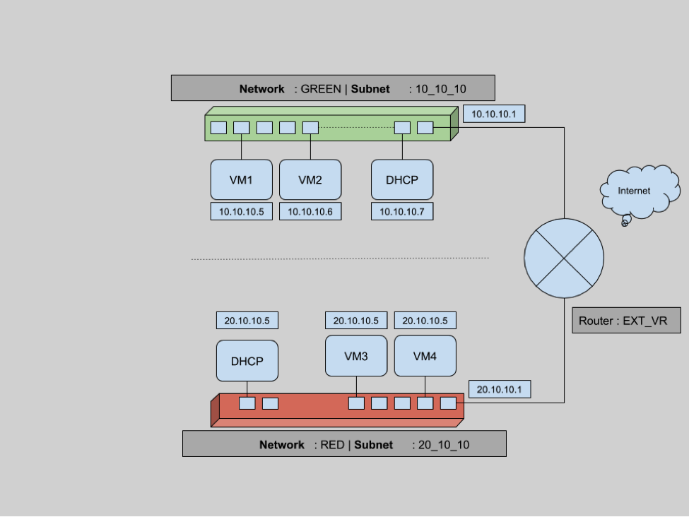
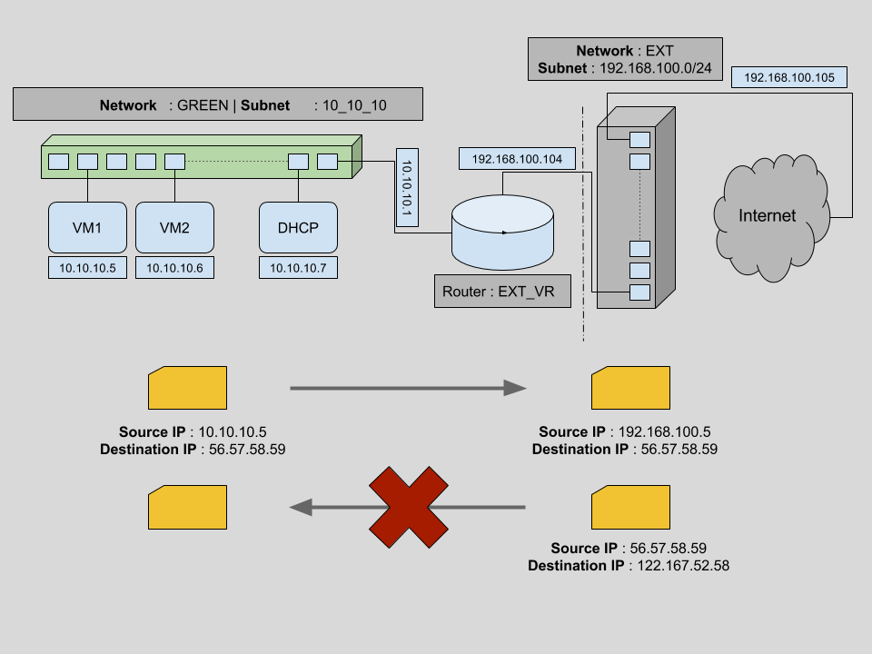

Title: Everything you need to know to get started with Neutron
Date: 2016-03-16
Category: openstack, neutron
Slug: everything-you-need-to-know-to-get-started-with-neutron

<div class="alert alert-primary" role="alert" style="color: #004085; background-color: #eff7ff; border-color: #b8daff; position: relative; padding: 0.75rem 1.25rem; margin-bottom: 1.5rem;">
Reblogged from my blog written for <a href="https://aptira.com/" style="color: #004085; text-decoration: underline;">@aptira</a> at <a href="https://aptira.com/everything-need-know-get-started-neutron/" style="color: #004085; text-decoration: underline;">everything you need to konw to get started with neutron</a>.
</div>

Understanding Neutron can be challenging if you are new to a Networking background or OpenStack. In this series of posts, we will try to cover OpenStack networking component in details. Readers wishing to learn more should take a look at our [OpenStack training](https://aptira.com/openstack-training/) courses. Both free and paid courses are available, suiting all levels of experience from beginner through to advanced. For more information, please [contact us](https://aptira.com/contact/).

As per the [official OpenStack documentation](http://docs.openstack.org/developer/neutron/), Neutron is an OpenStack project to provide “network connectivity as a service” between interface devices (e.g., vNICs) managed by other OpenStack services (e.g., nova).  In very simple terms neutron

- allows users to create and manage network objects, such as networks, subnets and ports, which other OpenStack services can use through an API.
- It enables a large number of operators to implement complex set of networking technologies to power their network infrastructure, through the use of agents, plugins and drivers.
- And that is all it is. I assure this will be the last bit of heavy wordings.

Let’s try to understand networking in OpenStack with an example scenario. As part of this four section article, we will create multiple networks and subnets. Then we will spawn multiple VMs across these networks and verify network connectivity for static IPs. We will then look into restricting access to VMs using security groups and finally an insight to connectivity across different networks using routers and floating IPs. Ready to go?

## Networks, Subnets & Ports
As promised, let’s first create some networks. For this section our plan is to

- create a network (GREEN). Create a subnet for this network and then spawn two VMs using this network.
- create another network (RED) with a different subnet and spawn another two VMs using this network
- verify ports created as part of above process and understand why OpenStack networking ports are useful.



On completion of this set of tasks, we will have a network infrastructure as shown above, containing

- two virtual networks(GREEN & RED)
- two subnets, one per virtual network 10.10.10.0/24 and 20.10.10.0/24
- four VMs (two per virtual network) with IPs dynamically assigned by DHCP on corresponding network.
- two DHCP hosts(automatically created if ticked while network creation)
- and six networking ports in use overall.

Let’s verify first that there are no existing networks. For all the below commands, we will use python CLI bindings for OpenStack ([python-neutronclient](http://docs.openstack.org/developer/python-neutronclient/) or [python-novaclient](http://docs.openstack.org/developer/python-novaclient/)).

```
$ root@controller (admin) $> neutron net-list
$ root@controller (admin) $> #...................................................................
```

Now we create our first network named GREEN.

```
$ root@controller (admin) $> neutron net-create GREEN
Created a new network:
+---------------------------+----------------------------------------------------------+
| Field                     | Value                                                    |
+---------------------------+----------------------------------------------------------+
| admin_state_up            | True                                                     |
| id                        | 6df1fa59-25a3-4f8c-8d14-ae7f7828c1a2                     |
| name                      | GREEN                                                    |
| provider:network_type     | gre                                                      |
| provider:physical_network |                                                          |
| provider:segmentation_id  | 101                                                      |
| router:external           | False                                                    |
| shared                    | False                                                    |
| status                    | ACTIVE                                                   |
| subnets                   |                                                          |
| tenant_id                 | 34609d0ea9ce48f98145ecc5bbac9f77                         |
+---------------------------------------------+----------------------------------------+
$ root@controller (admin) $> #...................................................................
```

As we can see, a new network with name GREEN is created. This network is of type GRE with a segmentation id of 101 (this will be covered more in the next blog in this series). Also you can note that this is not an external network (looking at router:external is False).

Now let’s create a subnet within this network. We chose 10.10.10.0./24 range for this subnet and a self explanatory name of 10_10_10.


```
$ root@controller (admin) $> neutron subnet-create --name 10_10_10 GREEN 10.10.10.0/24
Created a new subnet:
+-------------------------+----------------------------------------------------------+
| Field                   | Value                                                    |
+-------------------------+----------------------------------------------------------+
| allocation_pools        | {"start": "10.10.10.2", "end": "10.10.10.254"}           |
| cidr                    | 10.10.10.0/24                                            |
| dns_nameservers         |                                                          |
| enable_dhcp             | True                                                     |
| gateway_ip              | 10.10.10.1                                               |
| host_routes             |                                                          |
| id                      | 1667e8b9-e2fe-41a6-bfd2-7de41f777d6e                     |
| ip_version              | 4                                                        |
| ipv6_address_mode       |                                                          |
| ipv6_ra_mode            |                                                          |
| name                    | 10_10_10                                                 |
| network_id              | 6df1fa59-25a3-4f8c-8d14-ae7f7828c1a2                     |
| tenant_id               | 34609d0ea9ce48f98145ecc5bbac9f77                         |
+-------------------------+----------------------------------------------------------+
$ root@controller (admin) $> #...................................................................
```

We can see that a subnet is created with a default allocation pool of 10.10.10.2-10.10.10.254. Any new devices in this subnet will be assigned ip addresses from this range. The first and last IPs are special and they are reserved. Here 10.10.10.1 is the default gateway as shown in the output of

```
$ neutron subnet-create
```


command. The last IP of this range 10.10.10.255 is the broadcast address, which is reserved for broadcast usage.

Fetching the network list again, we can verify that our GREEN network has a new subnet 10.10.10.0/24.

```
$ root@controller (admin) $> neutron net-list
+-------------+-------+----------------------------------------------------+
| id          | name  | subnets                                            |
+-------------+-------+----------------------------------------------------+
| 6df --- 1a2 | GREEN | 1667e8b9-e2fe-41a6-bfd2-7de41f777d6e 10.10.10.0/24 |
+-------------+-------+----------------------------------------------------+
$ root@controller (admin) $> #...................................................................
```

Now that our basic network components are ready, let’s boot a couple of tiny VMs with this network,using the cirros image.

```
$ root@controller (admin) $> nova boot --flavor m1.tiny --image cirros --min-count 2 --nic net-id=6df1fa59-25a3-4f8c-8d14-ae7f7828c1a2 greenboxes
+--------------------------------------+-------------------------------------------------+
| Property                             | Value                                           |
+--------------------------------------+-------------------------------------------------+
| OS-DCF:diskConfig                    | MANUAL                                          |
| OS-EXT-AZ:availability_zone          | nova                                            |
| OS-EXT-SRV-ATTR:host                 | -                                               |
| OS-EXT-SRV-ATTR:hypervisor_hostname  | -                                               |
| OS-EXT-SRV-ATTR:instance_name        | instance-00000016                               |
| OS-EXT-STS:power_state               | 0                                               |
| OS-EXT-STS:task_state                | scheduling                                      |
| OS-EXT-STS:vm_state                  | building                                        |
| OS-SRV-USG:launched_at               | -                                               |
| OS-SRV-USG:terminated_at             | -                                               |
| accessIPv4                           |                                                 |
| accessIPv6                           |                                                 |
| adminPass                            | BurRPPiCm6TK                                    |
| config_drive                         |                                                 |
| created                              | 2016-03-09T02:04:56Z                            |
| flavor                               | m1.tiny (1)                                     |
| hostId                               |                                                 |
| id                                   | b2647e00-81e3-4290-b9c3-ce5e584c7265            |
| image                                | cirros (5c912cd4-729e-4f29-8761-eb04e630741d)   |
| key_name                             | default                                         |
| metadata                             | {}                                              |
| name                                 | greenboxes-b2647e00-81e3-4290-b9c3-ce5e584c7265 |
| os-extended-volumes:volumes_attached | []                                              |
| progress                             | 0                                               |
| security_groups                      | default                                         |
| status                               | BUILD                                           |
| tenant_id                            | 34609d0ea9ce48f98145ecc5bbac9f77                |
| updated                              | 2016-03-09T02:04:56Z                            |
| user_id                              | e9b23b6cb7ef4e7c99d8934e34163726                |
+--------------------------------------+-------------------------------------------------+
$ root@controller (admin) $> #...................................................................
```

This results in a message stating that two m1.tiny VMs with images cirros are building.

```
$ root@controller (admin) $> nova list --fields Name,Networks
+--------------------------------------+----------------------------------+------------------+
| ID                                   | Name                             | Networks         |
+--------------------------------------+----------------------------------+------------------+
| b2647e00-81e3-4290-b9c3-ce5e584c7265 | greenboxes-b2647e00-ce5e584c7265 | GREEN=10.10.10.5 |
| f0d6e68c-5e18-432c-b0a7-4ef6da054053 | greenboxes-f0d6e68c-4ef6da054053 | GREEN=10.10.10.6 |
+--------------------------------------+----------------------------------+------------------+
$ root@controller (admin) $> #...................................................................
```

A quick and short `nova list` above shows that the VMs have booted with two IPs in the 10_10_10 subnet. As part of the boot process, a port on the network virtual switch is attached to the virtual interface of the VM. Taking a look at the ports for this network should give us an understanding of the devices that have been added to this network.

```
$ root@controller (admin) $> neutron port-list -c id -c fixed_ips
+-----+-----------------------------------------------------------------------------------+
| id  | fixed_ips                                                                         |
+--------------------------------------+--------------------------------------------------+
| XXX | {"subnet_id": "1667e8b9-e2fe-41a6-bfd2-7de41f777d6e",  "ip_address": "10.10.10.6"} |
| XXX | {"subnet_id": "1667e8b9-e2fe-41a6-bfd2-7de41f777d6e",  "ip_address": "10.10.10.5"} |
| XXX | {"subnet_id": "1667e8b9-e2fe-41a6-bfd2-7de41f777d6e",  "ip_address": "10.10.10.4"} |
+-----+-----------------------------------------------------------------------------------+
$ root@controller (admin) $> #...................................................................
```


Hitting `neutron port-list` above shows that there are three ports created. Two attached to VM interfaces and one attached to a virtual DHCP server. This DHCP server is created because we didn’t disable DHCP while creating the network. This DHCP service is responsible for allocating dynamic IP addresses to virtual machines.

Another, easier way to verify port creation is from the horizon dashboard. On clicking on a a particular network, we are taken to the network details page where we can see the ports being used for the selected network. For example, upon opening the network details page of network GREEN, we see

We can see two Compute:None ports which tell us that those ports are connected to VMs. And one (10.10.10.4) port which is connected to the DHCP service.


> A Network in OpenStack is kind of a VLAN but with more flexibility.

> A Subnet is a block of IP addresses and associated configuration state. Subnets are used to allocate IP addresses when new ports are created on a network. &

> A Neutron Port is a connection point for attaching a single device, such as the NIC of a virtual server, to a virtual network. The port also describes the associated network configuration, such as the MAC and IP addresses to be used on that port.

Now that our first set of VMs and network components have been created, similarly we will create another new network (named RED), create another new subnet for this network and boot two new VMs using these networks and subnets. Assuming we have repeated the above steps, we can verify four instances in the  horizon dashboard, as below. These four instances are running in a set of two nodes, two connected to the GREEN network(10.10.10.X) and the other two connected to the RED (20.10.10.X) network.


Four instances running, two in GREEN network(10.10.10.X) & other two in RED (20.10.10.X) network.

There exist two networks

```
$ root@controller (admin) $> neutron net-list
+--------------------------------------+-------+-----------------------------------------+
| id                                   | name  | subnets                                 |
+--------------------------------------+-------+-----------------------------------------+
| 6df1fa59-25a3-4f8c-8d14-ae7f7828c1a2 | GREEN | 1667e8b9--7de41f777d6e 10.10.10.0/24    |
| 1048605e-41f6-4c10-be89-935f836a1b40 | RED   | db05f7e4--d9e164f86ca8 20.10.10.0/24    |
+--------------------------------------+-------+-----------------------------------------+
$ root@controller (admin) $> #................................................................
```

A total of six ports are created. Four ports for the four VMs and two ports to connect to two DHCP services per network.
```
$ root@controller (admin) $> neutron port-list -c id -c fixed_ips
+-----+----------------------------------------------------------------------------------+
| id  | fixed_ips                                                                        |
+-----+----------------------------------------------------------------------------------+
| XXX | {"subnet_id": "1667e8b9-e2fe-41a6-bfd2-7de41f777d6e", "ip_address": "10.10.10.6"}|
| XXX | {"subnet_id": "1667e8b9-e2fe-41a6-bfd2-7de41f777d6e", "ip_address": "10.10.10.5"}|
| XXX | {"subnet_id": "db05f7e4-2d48-4d86-8089-d9e164f86ca8", "ip_address": "20.10.10.6"}|
| XXX | {"subnet_id": "db05f7e4-2d48-4d86-8089-d9e164f86ca8", "ip_address": "20.10.10.4"}|
| XXX | {"subnet_id": "1667e8b9-e2fe-41a6-bfd2-7de41f777d6e", "ip_address": "10.10.10.4"}|
| XXX | {"subnet_id": "db05f7e4-2d48-4d86-8089-d9e164f86ca8", "ip_address": "20.10.10.5"}|
+-----+----------------------------------------------------------------------------------+
$ root@controller (admin) $> #...................................................................
```

As part of this section, we have created our network infrastructure as promised in the beginning of this section. This shows that with the help of Neutron Networks, Subnets and Ports, we can create a highly complex but flexible networking setup to match our needs.


## Security Groups 
In the previous section, even though the VMs are created and connected within same network, we might not be able to ping or ssh due to security groups. These are a virtual firewall for your compute instances to control inbound and outbound traffic. Security Groups in OpenStack are implemented per VM. You can create a bunch of security group rules and assign them to instances. There will be more in-depth details about security groups in future article of this series.

Let’s list all security groups
```
$ root@controller (admin) $> nova secgroup-list
+--------------------------------------+----------+----------------+
| Id                                   | Name     | Description    |
+--------------------------------------+----------+----------------+
| 4be520ef-58ad-4fa2-a471-2721290b88d7 | default  | default        |
+--------------------------------------+----------+----------------+
$ root@controller (admin) $> #...................................................................
```
And to list each rules for one such security group default

```
$ root@controller (admin) $> nova secgroup-list-rules default
+----------------+-----------+---------+------------+--------------+
| IP Protocol    | From Port | To Port | IP Range   | Source Group |
+----------------+-----------+---------+------------+--------------+
|                |           |         | default    |              |
| icmp           | -1        | -1      | 0.0.0.0/0  |              |
| tcp            | 1         | 65535   | 0.0.0.0/0  |              |
|                |           |         |            | default      |
| udp            | 1         | 65535   | 0.0.0.0/0  |              |
+----------------+-----------+---------+-------------+-------------+
$ root@controller (admin) $> #...................................................................

```
Let’s find out security group of any one of VM.
```
$ root@controller (admin) $> nova show greenboxes-b2647e00-81e3-4290-b9c3-ce5e584c7265 | grep security_groups
| security_groups                      | default                   |
$ root@controller (admin) $> #...................................................................
```

This suggests, our VM1 (greenboxes-b2647e00-81e3-4290-b9c3-ce5e584c7265) is booted with default security group. Now let’s add a rule to default to allow ssh connections(port 22).
```
$ root@controller (admin) $> nova secgroup-add-rule default tcp 22 22 0.0.0.0/0
+----------------+-----------+---------+------------+------------+
| IP Protocol    | From Port | To Port | IP Range | Source Group |
+----------------+-----------+---------+------------+------------+
| tcp            | 22        | 22      | 0.0.0.0/0  |            |
+----------------+-----------+---------+------------+------------+
$ root@controller (admin) $> nova secgroup-list-rules default | grep 22
| tcp            | 22        | 22      | 0.0.0.0/0  |            |
$ root@controller (admin) $> #...................................................................
```

Listing security groups for default security groups, we can verify that default secgrup has a rule for port 22. This means on any virtual machines booted with default security group, port 22  will be open for incoming connection and hence we can make ssh connection. These security group rules are project specific, and project members can edit the default rules for their group and add new rules sets.

## Routers

In the above diagram, instances within the network GREEN can talk to any other devices as long as they are in same network. This means that VM1 can send and receive packets from VM2, but not from VM3 or VM4. To provide connectivity between two different networks, routers come into the picture.

Routers are logical networking components which

- forward data packets between networks,
- provide L3 and NAT forwarding to provide external access for VMs on tenant networks.

Let’s demo these two features of routers. In this section, we will introduce a new router. Attach one end of each network to a router so that they are connected. Then we will create a dummy external network and make this router a gateway. This way all our VMs can communicate with the outside world. At the end of this section, we will have a setup as shown below.


To connect any two networks we need a router. Let’s create an external virtual router named EXT_VR.

```
$ root@controller (admin) $> neutron router-create EXT_VR
Created a new router:
+-----------------------+--------------------------------------+
| Field                 | Value                                |
+-----------------------+--------------------------------------+
| admin_state_up        | True                                 |
| distributed           | False                                |
| external_gateway_info |                                      |
| ha                    | False                                |
| id                    | c326b2b4-9076-4e12-9850-77d5f1c66c86 |
| name                  | EXT_VR                               |
| routes                |                                      |
| status                | ACTIVE                               |
| tenant_id             | 34609d0ea9ce48f98145ecc5bbac9f77     |
+-----------------------+--------------------------------------+
$ root@controller (admin) $> #...................................................................
```

Now we need to add the virtual interfaces of each network to this recently created router EXT_VR. This way we can have a network with multiple subnets and decide which subnet to connect to router.

```
$ root@controller (admin) $> neutron subnet-list -c id -c name -c cidr
+--------------------------------------+----------+---------------+
| id                                   | name     | cidr          |
+------------ -------------------------+----------+---------------+
| 1667e8b9-e2fe-41a6-bfd2-7de41f777d6e | 10_10_10 | 10.10.10.0/24 |
| db05f7e4-2d48-4d86-8089-d9e164f86ca8 | 20_10_10 | 20.10.10.0/24 |
+--------------------------------------+----------+---------------+
$ root@controller (admin) $> neutron router-interface-add c326b2b4-9076-4e12-9850-77d5f1c66c86 10_10_10
Added interface 64b09b83-1500-4caf-b9ea-ea4c8ec127d7 to router c326b2b4-9076-4e12-9850-77d5f1c66c86.
$ root@controller (admin) $> neutron router-interface-add c326b2b4-9076-4e12-9850-77d5f1c66c86 20_10_10
Added interface 0b1e3767-363e-49ba-8ee9-33c02db354bc to router c326b2b4-9076-4e12-9850-77d5f1c66c86.
$ root@controller (admin) $> #...................................................................
```

Now that both these networks are connected through router EXT_VR, we can verify connectivity.

```
$ cirros@vm1 $  ping -c 2 10.10.10.6
PING 10.10.10.6 (10.10.10.6) 56(84) bytes of data.
64 bytes from 10.10.10.6: icmp_seq=1 ttl=64 time=0.102 ms
64 bytes from 10.10.10.6: icmp_seq=2 ttl=64 time=0.120 ms
--- 10.10.10.6 ping statistics ---
2 packets transmitted, 2 received, 0% packet loss, time 999ms
rtt min/avg/max/mdev = 0.102/0.111/0.120/0.009 ms
$ cirros@vm1 $
$ cirros@vm1 $  ping -c 2 20.10.10.5
PING 20.10.10.5 (20.10.10.5) 56(84) bytes of data.
64 bytes from 20.10.10.5: icmp_seq=1 ttl=64 time=0.132 ms
64 bytes from 20.10.10.5: icmp_seq=2 ttl=64 time=0.180 ms
--- 20.10.10.5 ping statistics ---
2 packets transmitted, 2 received, 0% packet loss, time 999ms
rtt min/avg/max/mdev = 0.132/0.156/0.180/0.024 ms
$ root@controller (admin) $> #...................................................................
```

Even though we can see connectivity between virtual machines across different networks, there is still no Internet connectivity. Packets flowing from virtual machines can still not reach to any outside network. Our current state of network infrastructure looks like




Here two networks (RED & GREEN) are connected to the router but there is no connectivity between the router and the Internet as shown above. To do that we need to set this router as a gateway, which means connecting one interface of the router to the external network. In our case we have an existing external network, and we will add this network as a gateway for this router.


```
$ root@controller (admin) $> neutron router-gateway-set EXT_VR ext
$ root@controller (admin) $> #...................................................................
```

This will create a new port which will attach the external network to the router. Let’s verify this

```
$ root@controller (admin) $> neutron port-list -c id -c fixed_ips
+----+----------------------------------------------------------------------------------------+
| id | fixed_ips                                                                              |
+----+----------------------------------------------------------------------------------------+
| XX | {"subnet_id": "1667e8b9-e2fe-41a6-bfd2-7de41f777d6e", "ip_address": "10.10.10.6"}      |
| XX |  {"subnet_id": "acd4141a-149d-4a11-80bb-17eabaf0149f", "ip_address": "192.168.100.104"}|
| XX | {"subnet_id": "1667e8b9-e2fe-41a6-bfd2-7de41f777d6e", "ip_address": "10.10.10.5"}      |
| XX | {"subnet_id": "1667e8b9-e2fe-41a6-bfd2-7de41f777d6e", "ip_address": "10.10.10.1"}      |
| XX | {"subnet_id": "db05f7e4-2d48-4d86-8089-d9e164f86ca8", "ip_address": "20.10.10.6"}      |
| XX | {"subnet_id": "db05f7e4-2d48-4d86-8089-d9e164f86ca8", "ip_address": "20.10.10.4"}      |
| XX | {"subnet_id": "1667e8b9-e2fe-41a6-bfd2-7de41f777d6e", "ip_address": "10.10.10.4"}      |
| XX | {"subnet_id": "db05f7e4-2d48-4d86-8089-d9e164f86ca8", "ip_address": "20.10.10.5"}      |
| XX |  {"subnet_id": "acd4141a-149d-4a11-80bb-17eabaf0149f", "ip_address": "192.168.100.105"}|
| XX | {"subnet_id": "db05f7e4-2d48-4d86-8089-d9e164f86ca8", "ip_address": "20.10.10.1"}      |
+----+----------------------------------------------------------------------------------------+
$ root@controller (admin) $> #...................................................................
```

As we can see, there are two new ports (for 192.168.100.104 and for 192.168.100.105). These are the two new connection points, one attached router to external network and other external network to Internet. And now packets from inside the virtual machine can reach the internet.


## Floating IPs 

We have seen that the VMs from the previous step are able to reach outside public networks. But the opposite is not yet possible, we cannot reachthe VMs from an outside network. Any packet directed to say VM1 (having private IP 10.10.0.5) reaches the outside router but this gateway router has no way to distinguish target VM. Let’s try to understand this in more detail.



The above diagram is similar to our previous network infrastructure. Initially we try sending a packet from VM1 to an outside machine (with IP 56.57.58.59). Since VM1 is connected to the virtual router for external connectivity, the packet is able to reach the virtual router with a source IP of 10.10.10.5 and a target IP of 56.57.58.59. Our virtual external router EXT_VR then changes the source IP to its own IP address (192.168.0.19) and sends the packets to the correct destination. This is possible by sourcenet.

But for packet transfer from any outside source to any one of the VMs, packets can reach our external virtual router EXT_VR using the router’s public IP address. But based on the information provided in the packets, the virtual router has no way to identify the target VM.

One way to allow connectivity for a VM from outside networks is creating public IPs for each of the VMs. But this is not maintainable in the long term. In general we want our VMs to be disconnected from the public network except occasionally. Using public IPs per VM will lead us to a situation where we have to maintain a large pool of IPs per VM.

> Floating IPs are routable public IPs which can be assigned to a VM and revoked again. This is maintained on the router level.


As part of this section, let’s generate some floating IPs in the public network EXT. Then we will dynamically assign them to VM1 and verify connectivity.

```
$ root@controller (admin) $> neutron floatingip-list
$ root@controller (admin) $> root@controller (admin) $> neutron floatingip-create ext
Created a new floatingip:
+---------------------+----------------------------------------+
| Field               | Value                                  |
+---------------------+----------------------------------------+
| fixed_ip_address    |                                        |
| floating_ip_address | 192.168.100.103                        |
| floating_network_id | 4901039d-07b1-4ebf-91f1-559dd657e034   |
| id                  | 02ff1d61-6280-4f25-a8ff-9e5676ece01d   |
| port_id             |                                        |
| router_id           |                                        |
| status              | DOWN                                   |
| tenant_id           | 34609d0ea9ce48f98145ecc5bbac9f77       |
+---------------------+----------------------------------------+
$ root@controller (admin) $> neutron floatingip-associate 02ff1d61-6280-4f25-a8ff-9e5676ece01d 378956ec-3928-4e06-873c-423b7f017695
$ root@controller (admin) $>
$ root@controller (admin) $> neutron floatingip-list -c id -c fixed_ip_address -c floating_ip_address
+---------------------- ---------------+------------------+---------------------+
| id                                   | fixed_ip_address | floating_ip_address |
+--------------------------------------+------------------+---------------------+
| 02ff1d61-6280-4f25-a8ff-9e5676ece01d | 10.10.10.5       | 192.168.100.103     |
+--------------------------------------+------------------+---------------------+
$ root@controller (admin) $> #...................................................................
```

The initial neutron `floatingip-list` command gives no result. This means there is no existing floating ips. Then we generated a floating-ip on ext network. This IP will be randomly selected from the pool of network addresses for network ext. We find out the port of VM we want it to attach to. Using neutron `floatingip-associate`, we can associate this floating IP with a virtual machine port. This establishes the connection to VM1 from an outside network.


## Conclusion

This brings us to the end of this large getting started with Neutron guide. We now have an understanding of how to create networks and subnets in an OpenStack cloud. We also looked at blocking traffic per virtual machine through the use of security groups. We saw how to connect different networks using L3 switching and routers, and we used floating IPs to allow external connectivity to virtual machines.

If you’d like to know more, don’t forget to checkout our [OpenStack training](https://aptira.com/openstack-training/) courses or [contact us](https://aptira.com/contact/) with any questions.


