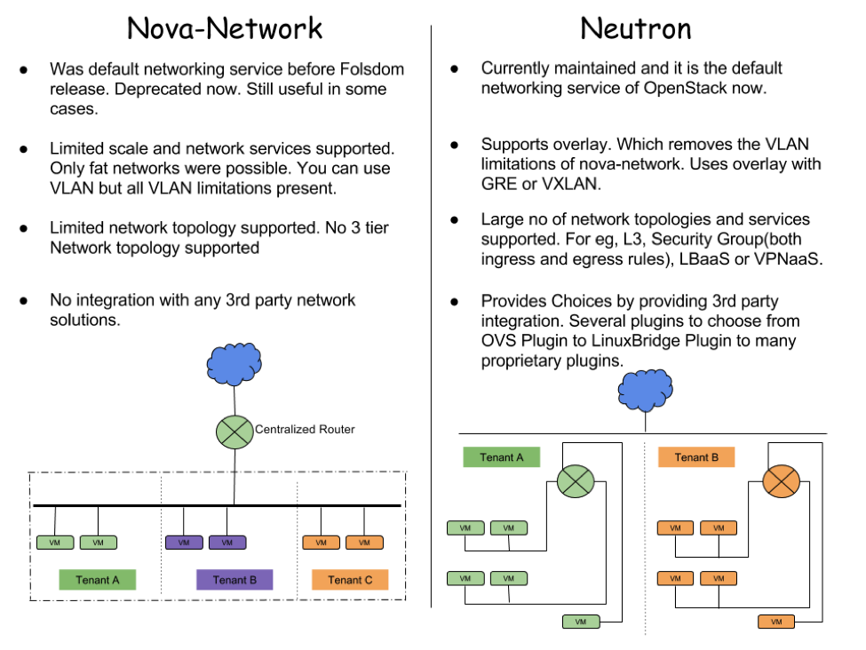
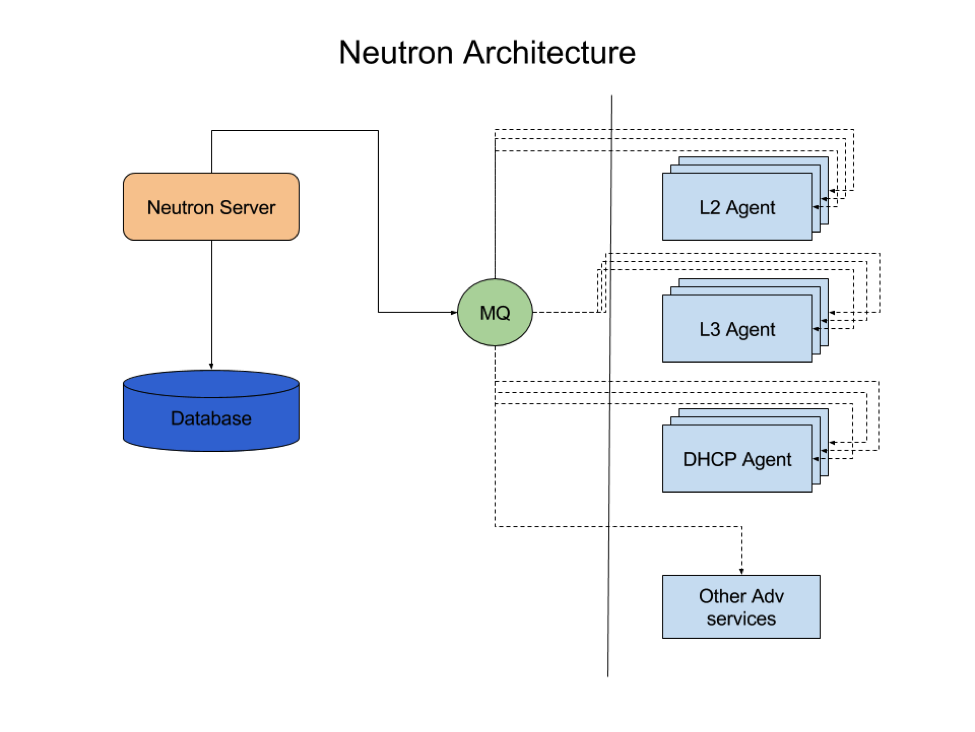
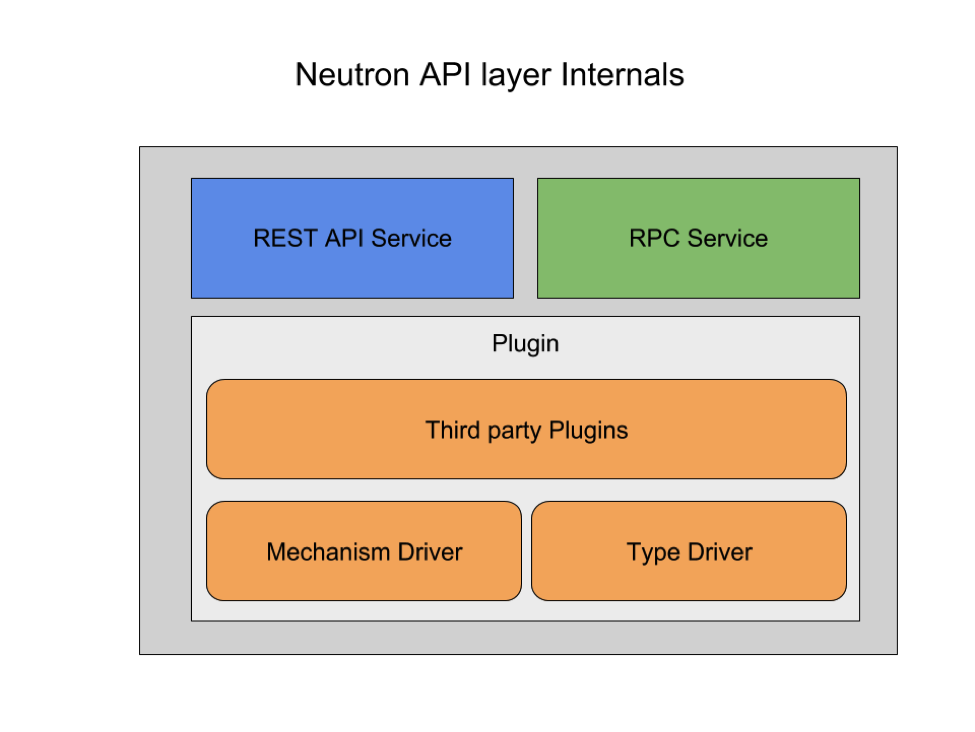
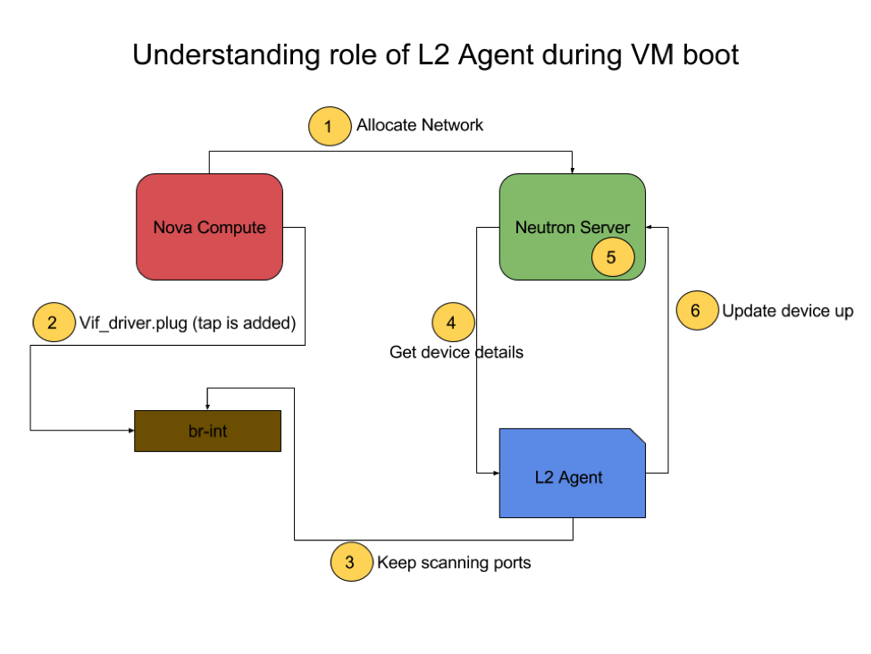
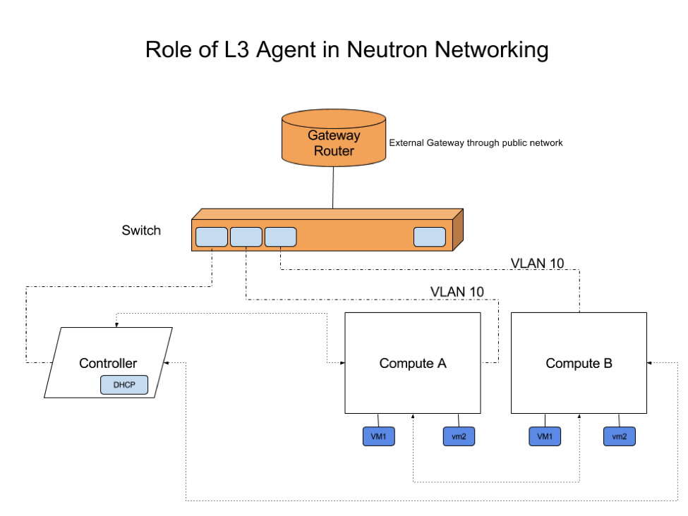

Title: Theory Of Everythin... well, In Neutron!
Date: 2016-09-06
Category: openstack, neutron
Slug: theory-of-everything-in-neutron

Reblogged from my blog written for <a href="https://aptira.com/" style="color: #004085; text-decoration: underline;">@aptira</a> at <a href="https://aptira.com/theory-of-everything-in-neutron/" style="color: #004085; text-decoration: underline;">theory of everything in neutron</a>

In a previous blog post about getting started with neutron, we glanced through workings of OpenStack neutron. This post will allow readers to understand the details of Neutron.

As part of this we will cover:

- Features.
- How is it different to older and now deprecated nova-network.
- Architecture of and internals.
- L2 Agents.
- L3 Agents.

Readers wishing to learn more should take a look at our [OpenStack training](https://aptira.com/openstack-training/) courses. Both free and paid courses are available, suiting all levels of experience from beginner through to advanced. For more information please contact us.

## Features
As the official wiki states:

Neutron is an OpenStack project to provide “networking as a service” between interface devices (e.g., vNICs) managed by other Openstack services (e.g., nova).

Essentially neutron exposes a set of APIs and provides pluggable interface to a lot of third party and community developed plugins which can be used to bring up a highly robust networking infrastructure with extended capability.

In simple terms some core features are:

- **Has a Unified API & Core.** Networking can be complex because of multiple device support. Keeping API’s small make it much easier to accommodate and maintain many types of devices. 
- **Overlapping IP stack.** As we will find, neutron can provide isolated tenant networks within a project. This is because of overlapping IP stack.
- **Floating IPs.** Gives you an ability to map an address from public range and have them attached to a VIF (Virtual Interface) of a VM.
- **Pluggable Open Arch.** Many ways to achieve L2 connectivity. This type of pluggable Open Architecture allows to create such architecture.
- **Extensible.** Routing extensions, security group extensions and LB extensions give much needed features set to neutron, but still keep the core small and maintainable.
- **Security Groups.** Different tenants. Neutron supports egress traffic. Logical implementation.

## Neutron vs Nova Networks

Though we will cover Neutron as part of this post, it is better to understand its predecessor. Before neutron, OpenStack networking was done by Nova network. Here is a brief comparison between the two.

## Architecture & Internals
Neutron is plugin extensible by design. Most of the extended features are provided by agents which can be stacked linearly for scaling. This make it very easy to maintain core features, and at the same time easily add additional features.

The below diagram showcases the internals of neutrol. Neutron consists of three components, a server (API layer) and a database layer. This database is connected to a neutron-server. The neutron server can pass requests to a message queue which takes requests from neutron-server and passes on to corresponding agents.

If you are using the builtin reference implementation, you will have an L2 Agent running. For the case of providing multi tenancy and other layer 3 features, we can add L3 agents. This will be responsible for virtual routing and floating IPs.

You may also need a DHCP agent which takes care of the IP stack on booting VMs. You can even break different subnets for different DHCP agents.

Neutron can be further extended to provide advanced L4 to L7 features such as a Load Balancer as a service or Firewall as a service using the extra corresponding agent.

### Neutron Server
If we look inside the Neutron-Server, which works as the API layer, it can be further subdivided into three major components. The first two parts of the API core are pretty obvious. One service to provide API interfaces and the other service talks to message queue.

It is the third party plugins component which is very important. This is the core of neutron.

#### ML2 PLUGIN
This plugin could be a monolithic core plugin, or it could be an ML2 plugin. The ML2 plugin is the default option which utilises a large number of existing L2 networking solutions. This also provides support for OVS, linux bridge and Hyper V. With this we can actually run linux bridge and OVS at the same time.

This ML2 framework is also intended to greatly simplify adding support for any new L2 networking technologies, requiring much less initial and ongoing effort to add a new monolithic core plugin.

#### TYPE DRIVER
Based on network type such as local, flat, VLAN, GRE or VXLAN, TypeDrivers provide drivers for that particular network type. TypeDrivers provide network state for this specific type and other network validation and tenant allocation.

#### MECHANISM DRIVER
Each networking mechanism is managed by an ML2 MechanismDriver. The MechanismDriver is responsible for taking the information established by the TypeDriver and ensuring that it is properly applied given the specific networking mechanisms that have been enabled. For example Quota, Qos, Extra Routes, metering etc.

## L2 Agents
L2 agents run on the hypervisor (compute node). Its main responsibility is to configure software bridges on those compute nodes. L2 agents sit on watcher to watch notifications that a new device has been added or removed. Apart from this, it also handles security group rules.

This actually supports VLAN, GRE and VXLAN for network isolation. For the implementation with OVS, it uses ovsdb to talk to OVS for networking setup.

We can better understand L2 agent using the diagram below. Whenever a new instance is spawn, nova compute adds a tap interface (a vif driver interface) and then requests neutron for a new network allocation.

Meanwhile the L2 agent is separately watching for any new VIF interfaces, and records the newly spawned interface. Next, it fetches details about the device attached to this interface from the neutron-server.

The server then allocates a network for this resource which means creating tap interface on the VM using linux bridge and putting in security group rules (using iptables).

Once the L2 agent is able to establish connection, it updates neutron-server that device is up.

## L3 Agents
While L2 agents let your virtual machine get attached to your network, an L3 agent gets the routers attached to each other, providing network ready resources.

All level 3 forwarding and NAT across tenant networks is done through Linux Network namespaces and iptables. This provides multiple routers with overlapping IP address. Within a cloud environment where virtual machines need to be frequently created or destroyed, neutron’s overlapping IPs are very useful feature.

Apart from this, neutron’s floating IP feature allows internal Virtual Machines to connect to or from outside the public network. These floating IPs aren’t hooked to an instance, rather it is connected to the neutron port.

We can use python client command line APIs to show any port associated with a neutron instance.

Internally, Neutron receives update requests for routers from the server. Upon getting an update request, the L3 agent puts this on a processing queue of its own.

Based on your requirements, we can configure neutron with a provided feature set and extend it at a later stage.

If you’d like to know more, don’t forget to checkout our [OpenStack Training](https://aptira.com/openstack-training/) courses or [contact us](https://aptira.com/contact/) with any questions.

